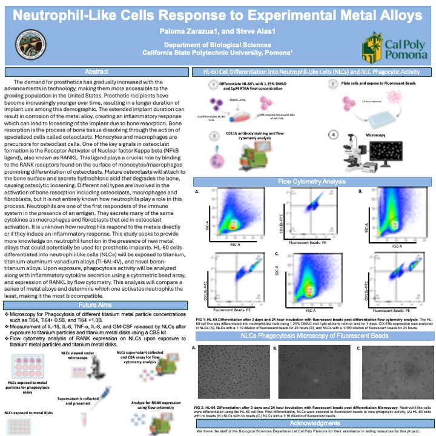
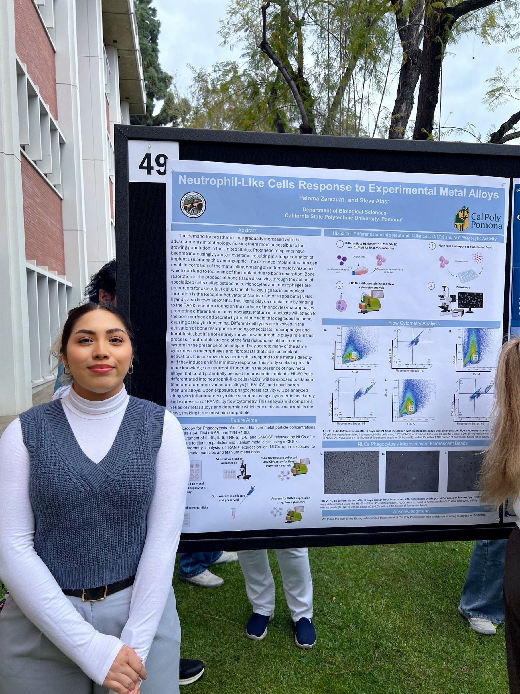

## Education

### Master of Science in Biological Sciences
_Emphasis in Cell and Molecular Biology_

California State Polytechnic University, Pomona

August 2023 – December 2025

### Bachelor of Science, Major in Biology

University of La Verne

August 2019 – December 2022

## Poster Presentations

### Cal Poly Pomona College of Science Research Symposium | May 2025

**Poster:** Neutrophil-Like Cells Response to Experimental Metal Alloys

:::: {.columns}

::: {.column width="70%"}
{width=100%}
:::

::: {.column width="30%"}
{width=100%}
:::

::::

## Technical Laboratory Skills

### Cell Culture & Experimental Techniques

- Mammalian cell culture (HL-60 human promyelocytic cell line)
- Differentiation of HL-60 cells into neutrophil-like cells (NLCs)
- Cell counting, viability assessment, and culture optimization
- Sterile technique and aseptic workflows
- Preparation of media, buffers, and experimental reagents

### Immunology & Functional Assays

- In vitro modeling of innate immune responses
- Phagocytosis assays using fluorescent beads
- Cell surface marker analysis (e.g., CD11b, RANKL)
- Cytokine secretion analysis using multiplex bead-based assays
- Sample processing and supernatant collection for downstream analysis

### Flow Cytometry & Microscopy

- Flow cytometry data acquisition and interpretation
- Gating strategies, controls, and quality control
- FlowJo and LEGENDplex data analysis
- Fluorescence and brightfield microscopy
- Imaging and interpretation of cellular responses

### Data Analysis & Research Tools

- Statistical analysis in R (tidyverse, dplyr)
- Data visualization and figure preparation
- Reproducible research workflows
- Microsoft Office and Google Workspace
- GitHub for project documentation and portfolio hosting

## Teaching, Mentoring, and Training Experience

### Teaching Associate

**BIO 1110L** Life Science Lab (F24)  
**BIO 1150L** Biology and Society (F25)  
**BIO 1220L** Foundations of Biology: Evolution, Ecology, and Biodiversity (SP25)  
**BIO 2350L** Human Physiology Lab (F23, SP24)

Department of Biological Sciences  
California State Polytechnic University, Pomona

_August 2023 – December 2025_

---

### Training of Graduate and Undergraduate Lab Members

Steve Alas Lab  
Department of Biological Sciences  
California State Polytechnic University, Pomona

_August 2023 – December 2025_

---

### Math and Reading K–12 Tutor

Step Up Tutoring

_October 2024 – May 2025_

---

### CLASP Tutoring | Claremont, CA

_October 2022 – December 2023_

---

### Boys and Girls Club | La Puente, CA

_March 2019 – May 2019_

## Work Experience

**Student Assistant**, College of Business and Public Management, University of La Verne  
_September 2022 – December 2022_

**Patient Representative**, COPE Health Solutions – University of Texas Rio Grande  
_September 2021 – October 2022_

**Health Scholar**, COPE Health Scholars – Emanate Health  
_March 2021 – May 2022_