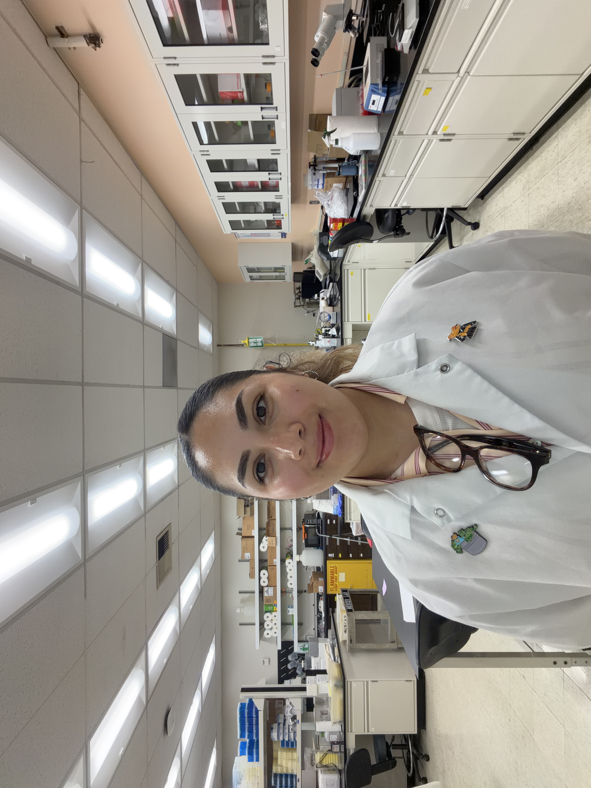

---
# Zarazua Research Website
---

# Welcome to my website!

My name is **Paloma Zarazua**, and I hold a Master’s degree in Biology from California State Polytechnic University, Pomona. I am a biomedical researcher with experience spanning immunology, biomaterials, mammalian cell culture, flow cytometry, and human biological sample processing. I am particularly interested in research that explores how immune cells respond to their environments and how these responses influence inflammation, tissue health, and disease.

During my graduate research, I investigated how experimental metal alloys intended for use in prosthetic implants influence inflammatory responses in neutrophil-like cells. My work focused on characterizing cytokine secretion and surface marker expression following exposure to different biomaterials, with the broader goal of understanding how material composition can influence immune activation and implant biocompatibility. Through this research, I developed experience with mammalian cell culture, HL-60 differentiation, flow cytometry using the MACSQuant Analyzer, FlowJo data analysis, cytokine bead array assays, and fluorescence microscopy.

In addition to my graduate research, I have gained hands-on experience supporting biomedical research involving human participants under IRB-approved protocols. My laboratory experience includes phlebotomy, processing clinical blood samples, and isolating primary peripheral blood mononuclear cells (PBMCs), monocytes, and neutrophils using density-gradient and dextran-based separation methods. I currently support research projects investigating interactions between immune cells and infectious organisms, contributing to studies involving primary human immune cells and their roles in host defense and immune responses.

My research interests lie at the intersection of immunology, innate immune cell biology, biomaterials, and translational biomedical research. I am especially interested in understanding how immune cells sense and respond to their environments and how these responses can be applied to improve human health. I am motivated by opportunities to contribute to collaborative research programs, develop advanced laboratory skills, and support scientific work that has meaningful clinical or translational relevance.

I also value mentorship and education. Throughout my graduate training, I mentored undergraduate researchers in the laboratory and taught students from diverse backgrounds in courses including Human Physiology, Life Science, and Foundations of Biology. These experiences strengthened my communication skills and reinforced my interest in helping others develop confidence and independence in the sciences.

Outside of the laboratory, I enjoy baking and creating new recipes—an unexpected passion that has deepened my appreciation for experimentation, persistence, and problem-solving. Much like research, baking involves iteration, failure, and refinement, and I have learned to embrace the process rather than fear mistakes.

I am currently interested in opportunities within academic research institutions, cancer centers, hospitals, and biomedical research organizations where I can contribute to ongoing research, expand my technical expertise, and continue growing as a scientist. I am particularly interested in roles involving flow cytometry, immune monitoring, clinical sample processing, and translational research.

On this site, you’ll find information about my research journey, laboratory experiences, teaching and mentorship, and the scientific questions that continue to shape my career.

  

  <a href="https://www.linkedin.com/in/paloma-zarazua-93a850213/" target="_blank"
     style="display: inline-block; margin-top: 10px; background-color:#fff; color:#de378d;
            padding: 10px 20px; text-decoration: none; border-radius: 5px; font-weight: bold;">
    Connect with me on LinkedIn
  </a>

